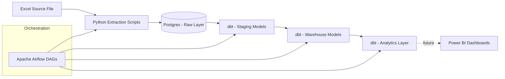

# 🛠️ Local ETL Pipeline: Excel → Postgres → dbt → Airflow

A fully containerized, end-to-end ETL pipeline built and orchestrated entirely on a local machine — no cloud costs, no trial expirations, no billing dashboards. Just Docker, Airflow, dbt, and Postgres working together to turn a raw Excel sheet into analytics-ready data.

---

## 📖 Overview

This project extracts raw data from an Excel source, ingests it into a Postgres database, applies staged transformations (raw → staging → warehouse), and packages the results into analytics-ready models — all orchestrated automatically by Apache Airflow and running on Docker.

It started as a way to get hands-on with the core tools of the modern data stack, and has since grown into an ongoing learning project that's updated periodically as new skills and techniques are added.

## 🏗️ Architecture



**Flow summary:**
1. **Extract** — Python scripts pull raw data from an Excel workbook.
2. **Load** — Data is ingested into a raw Postgres schema.
3. **Transform** — dbt models clean and reshape data through staging and warehouse layers.
4. **Serve** — Final analytics tables are packaged for downstream reporting.
5. **Orchestrate** — Apache Airflow schedules and runs the entire pipeline end-to-end.

## 🧰 Tech Stack

| Layer | Tool |
|---|---|
| Containerization | Docker / Docker Compose |
| Database | PostgreSQL |
| Database GUI | pgAdmin |
| Transformation | dbt (data build tool) |
| Orchestration | Apache Airflow |
| Scripting | Python |
| Source Data | Excel (.xlsx) |
| Visualization *(planned)* | Power BI |


## ⚙️ Getting Started

### Prerequisites
- Docker Desktop installed and running
- Git

### Setup

```bash
# Clone the repo
git clone https://github.com/tahmislam21/Dockerized-ELT-Pipeline-with-Airflow-and-dbt.git
cd Dockerized-ELT-Pipeline-with-Airflow-and-dbt

# Spin up all services
docker compose up -d

# Check that containers are running
docker ps
```

### Access the tools
| Service | URL | Notes |
|---|---|---|
| Airflow UI | http://localhost:8080 | Trigger and monitor DAGs |
| pgAdmin | http://localhost:5050 | Inspect the Postgres database |

Once the containers are up, trigger the DAG from the Airflow UI to run the full pipeline: extraction → loading → transformation → analytics.

## ✅ Current Features

- Automated extraction from an Excel data source
- Ingestion into a raw Postgres layer
- Staging and warehouse transformations via dbt
- Analytics-ready output models
- Full orchestration via Apache Airflow DAGs
- Fully containerized with Docker Compose

## 🗺️ Roadmap

- [ ] Integrate Power BI for end-to-end visualization
- [ ] Implement dbt snapshots for SCD Type 2 tracking
- [ ] Add automated email alerts on DAG/pipeline failure
- [ ] Expand transformation complexity in the staging layer
- [ ] ...and more to come

## 📝 Notes

This project is a personal learning journey in data engineering. Updates are shared periodically on LinkedIn as new features are added — feel free to follow along or connect if you're working on something similar.

## 📄 License

This project is open source. Feel free to fork, adapt, and build on it for your own learning.
